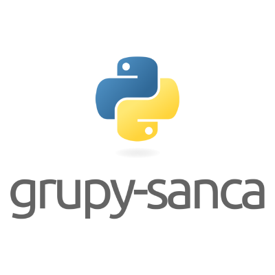

# Exercícios e Desafios RESOLVIDOS do curso introdutório da grupy-sanca!

### A LISTA DE EXERCÍCIOS E DESAFIOS PODEM SER ENCONTRADAS NO LINK https://curso-intro-python.readthedocs.io/exercicios.html

# CONTEÚDO

### 0 - DESAFIOS

### 1 - OPERADORES MATEMÁTICOS:

### 2 - EXPRESSÕES NUMÉRICAS

### 3 - VARIÁVEIS

### 4 - STRINGS

### 5 - TECLADO

### 6 - LISTAS

### 7 - DICIONÁRIOS

### 8 - ESTRUTURAS DE CONTROLE

### 9 - ESTRUTURAS DE REPETIÇÃO

### 10 - FUNÇÕES
